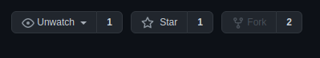

# Содействие

Здесь будут представлены базовые шаги, которые необходимы для внесения изменений в проект.

## 1. Копия репозитория

В GitHub существует понятие — форк (fork). Если вкратце, то это полная копия репозитория, в которой у вас будет полный доступ к файлам проекта, с возможностью их редактирования.

Данный подход существует для того, чтобы каждый мог сделать изменения и предложить их автору. Этот шаг будет описан ниже.

Для того, чтобы сделать форк, нужно нажать на соответствующую кнопку "Fork" на странице репозитория.

Кнопки управленим репозиторием, находящиеся в правом верхнем углу.

## 2. Редактирование форка

После того, как репозиторий скопирован, он будет доступен по ссылке: `https://github.com/{ваше имя пользователя}/es-doc`.

Например, если ваше имя пользователя `user123`, то форк будет доступен по ссылке: `https://github.com/user123/es-doc`.

В ваш форк вы можете без опасения вносить любые изменения, будь то тестирование чего-то, исправление контента или любое, душе угодное, действие. Не забывайте, что ваши последующие изменения необходимо отправлять ("push'ить") в форк. Если у вас имеется программа `GitHub Desktop` то после сохранения изменений, кнопка `Fetch origin` изменится на `Push origin`, позволяя загрузить изменения в ваш репозиторий.

## 3. Предложение изменений
