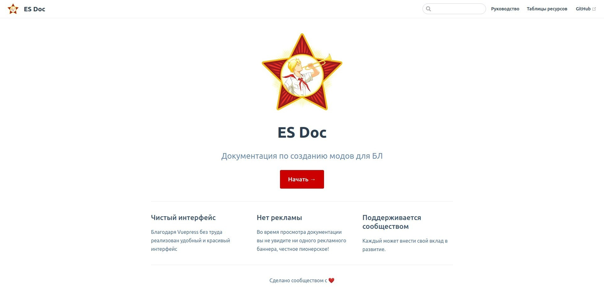

# es-doc



Документация по созданию модов для БЛ.


## Запуск проекта

### Предпосылки

Необходимые инструменты:

- [Node.js](https://nodejs.org/).
- [Yarn classic](https://classic.yarnpkg.com/) (рекомендуется) или [NPM](https://www.npmjs.com/).
- [Visual Studio Code](https://code.visualstudio.com/) (рекомендуется).

### Клонирование репозитория

Если не настроен SSH, то:

```bash
git clone https://github.com/yegorgunko/es-doc.git
```

или:

```bash
git clone git@github.com:yegorgunko/es-doc.git
```

Также можно скачать последнюю версию по [ссылке](https://github.com/yegorgunko/es-doc/archive/refs/heads/master.zip).

### Установка зависимостей

```bash
yarn # npm i
```

### Запуск проекта в режиме разработки

```bash
yarn dev # npm run dev
```
